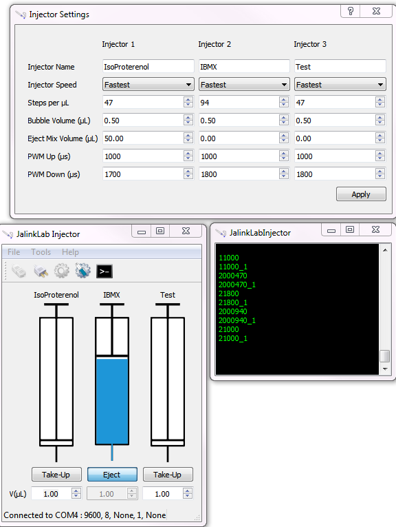

# GUI for the arduino injector
Interacts with arduino by sending and recieving messages from the serial port. The arduino controls servo and stepper motors to operate an automated injector.
Created to be user friendly and automate the injection and mixing of stimuli as much as possible.

